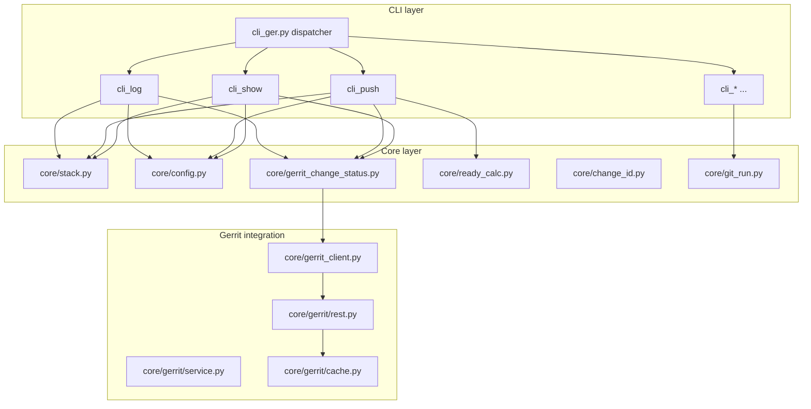
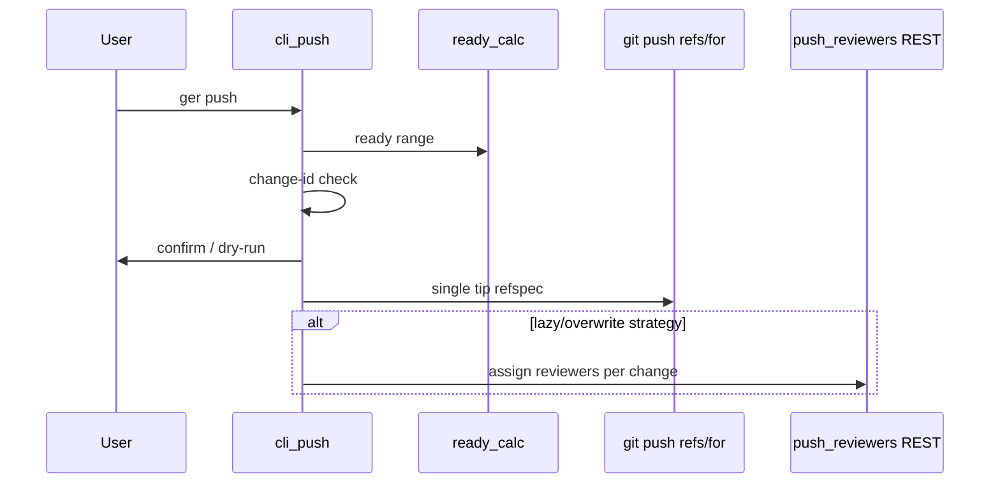

# Architecture overview

How **`ger`** is structured, which modules own which concerns, and how commands share behavior. Command-level detail lives under [spec/commands/](spec/commands/); product scope in [Version 1 Scope.md](Version%201%20Scope.md).

---

## Problem domain

Developers maintain a **local stack** of commits (each with a Gerrit **Change-Id**), push a **ready prefix** to `refs/for/<target>`, and iterate on review feedback. The tools answer:

1. **What is the stack vs Gerrit?** (`ger log`, `ger show`)
2. **What should I push?** (`ger push` + ready boundary)
3. **How do I edit the stack safely?** (`ger edit`, `ger reword`, `ger fix`, `ger rebase`)

---

## Layered structure

| Layer | Responsibility |
|-------|----------------|
| **`cli_ger.py`** | Lazy dispatch, global `--refresh`, command registry |
| **`cli_*.py`** | Argparse, terminal UX, exit codes |
| **`cli_common.py`** | Shared argparse helpers, logging/color init, error handling |
| **`core/`** | Git stack math, config, Change-Id parsing, ready boundary, Gerrit status model |
| **`core/gerrit/`** | REST paths, SQLite cache, typed models, `GerritService` orchestration |
| **Auxiliary** | `rebase_enricher.py`, `push_input_prompt.py`, `bash_completion_generator.py` |

---

## Shared concepts

### Local stack

Commits in **`upstream_tip..HEAD`** (or an explicit `REV_RANGE`). The upstream tip comes from `branch@{upstream}` unless a command overrides the range.

- Resolved in `core/stack.py` (`StackSnapshot`, `Commit`).
- **Not** the same as “all commits on Gerrit” — only what is local and above the tracking branch.

### Gerrit target branch

The server branch name used for `refs/for/<target>` and merge-base (e.g. `main`). Sources, in order of precedence for push/rebase:

1. `branch.<name>.gerritTarget` (optional override)
2. Inferred from `@{upstream}` when its remote equals `gerrit.remote` (default `origin`)

Configured via `ger branch`; see [spec/commands/branch.md](spec/commands/branch.md).

### Ready boundary

First commit whose **subject** matches a `gerrit.stopPattern` regex (built-in defaults if none configured). Commits from that point are excluded from the default push range unless `ger push --all` or `--ignore-pattern` is used.

- Logic: `core/ready_calc.py`
- Highlighting: `gerrit.stopPattern` / `gerrit.warningPattern` via `summary_highlight.py`

### Change-Id

Footer `Change-Id: I<40 hex>` in commit messages. Required for Gerrit-mode push and for correlating local SHAs with Gerrit changes.

- Parse/validate: `core/change_id.py`, `cli_changeid.py`
- Duplicate check: `ger change-id --check-duplicates`

### Patchset status (log / show / rebase annotations)

| Token | Meaning |
|-------|---------|
| `p` / `active` | Local SHA is Gerrit’s **current** patch set |
| `n` / `newer` | Change exists; local commit is **ahead** of server tip |
| `o` / `outdated` | Local SHA was uploaded but is **not** current on server |
| `-` / `absent` | No Gerrit change for this Change-Id |

Computed in `core/gerrit_change_status.py` (`enrich_commits_with_gerrit`, `StackCommitGerrit`).

### Attention

A commit **needs attention** when any of `determine_attention()` reasons apply (unresolved comments, CI failure, missing CR+2, chain-blocked, etc.). Same rules drive:

- `ger log` summary exit code `1`
- `ger edit --first-attention-commit`
- `ger rebase` enricher annotations

Source: `core/gerrit_change_status.py` (`determine_attention`, `EDIT_ATTENTION_REASONS`).

### Gerrit API access

Commands that call Gerrit require `gerrit.webUrl` and credentials (`gerrit.user` + `gerrit.token` or `gerrit.password`).

- HTTP: `core/gerrit/rest.py` (`GerritRestClient`)
- High-level fetch: `core/gerrit_client.py` / `core/gerrit/service.py`
- Disk cache: `core/gerrit/cache.py` (`GerritCache`); `ger cache`, `ger --refresh`

---

## Command families

### Read-only Gerrit overlay

`ger log`, `ger show`, `ger rebase` (enrichment only) batch-fetch change details and comments through `GerritService`, then apply `gerrit_change_status` enrichment.

### Git mutation

`ger push`, `ger edit`, `ger reword`, `ger fix`, `ger rebase` (starts `git rebase -i`), `ger change-id --fix` invoke git (and sometimes REST after push).

### Local-only

`ger sha`, `ger change-id` (except `--fix`), `ger branch` (config writes only) — no Gerrit HTTP.

### Push pipeline (Gerrit mode)

Reviewer strategies (`push`, `lazy`, `overwrite`) and magic ref options (`%topic`, `%wip`, `%private`) are documented in [spec/commands/push.md](spec/commands/push.md).

---

## Module map (implementation)

| Module | Role |
|--------|------|
| `cli_ger.py` | Command table, aliases, `--refresh` |
| `cli_log.py` | Stack overview output (text/JSON) |
| `cli_push.py` | Push modes, confirmation, reviewer plan |
| `cli_show.py` | Single-change detail + comments |
| `cli_edit.py` | Interactive rebase targeting one commit |
| `cli_fix.py` | `git commit --fixup` wrapper |
| `cli_rebase.py` | `GIT_SEQUENCE_EDITOR` enricher hook |
| `cli_branch.py` | Branch-local git config |
| `cli_sha.py` / `cli_changeid.py` | Identifier plumbing |
| `cli_fetch_api.py` / `cli_cache.py` | Debug utilities |
| `cli_bash_completion.py` | Completion install |
| `core/gerrit_change_status.py` | Status model, attention, comment helpers |
| `core/push_reviewers.py` | REST reviewer apply after push |
| `rebase_enricher.py` | Annotate rebase todo lines |

---

## Onboarding

Minimum path for a new teammate (v1):

1. Install `ger` ([README.md](../README.md)).
2. `git config --global gerrit.webUrl <url>` and credentials.
3. `ger branch init --target <branch> --reviewers …` (or `infer-upstream`).
4. Commit-msg hook for Change-Ids (manual until `ger hooks` — v1.1).
5. `ger bash-completion --install` (recommended).
6. Daily: `ger log` → `ger show <ref>` → `ger push`.

Config details: [Configuration.md](Configuration.md).

---

## Spec maintenance

When changing behavior:

1. Update the relevant `spec/commands/<cmd>.md`.
2. If the change is a **v1 scope** item, update [Version 1 Scope.md](Version%201%20Scope.md) (check off or adjust).
3. Run tests; integration tests live under `tests/integration/` (optional).

Candidate refactors (not spec): [ABSTRACTIONS.md](../ABSTRACTIONS.md).
