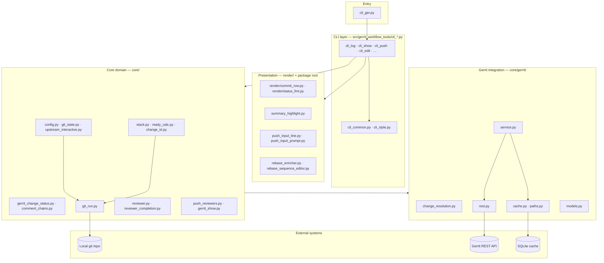
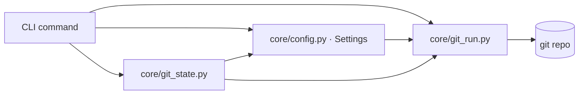
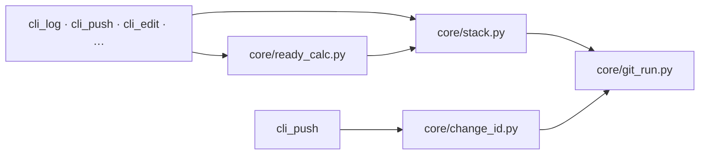
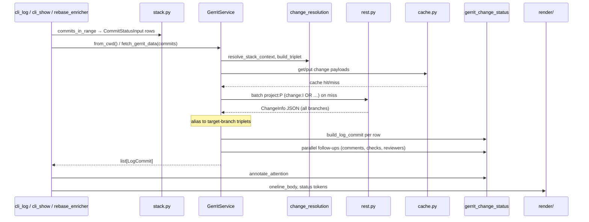
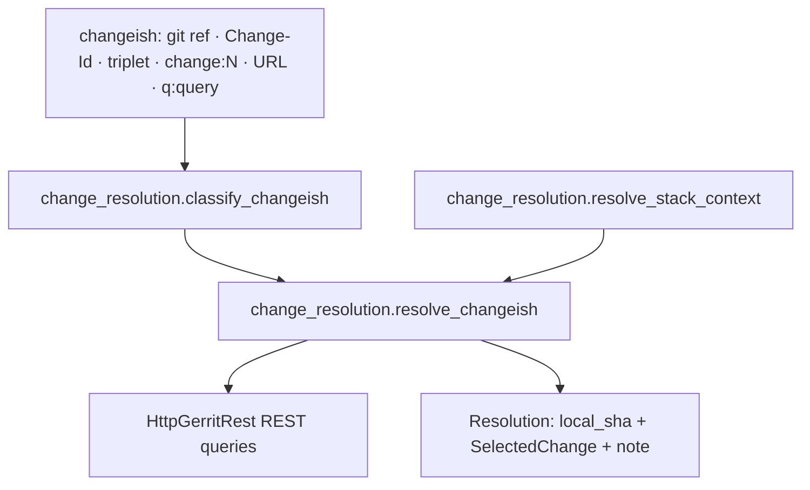
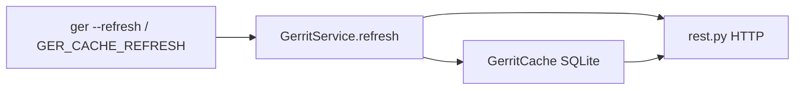

# Architecture overview

How **`ger`** is structured, where each part lives, and how data flows between layers. Command-level behavior is specified under [spec/commands/](spec/commands/).

---

## Repository layout

| Path | Role |
|------|------|
| `src/gerrit_workflow_tools/` | All application code (Python package) |
| `src/gerrit_workflow_tools/cli_*.py` | One module per shipped command (+ dispatcher) |
| `src/gerrit_workflow_tools/core/` | Domain logic: git stack, config, Gerrit status, REST |
| `src/gerrit_workflow_tools/core/gerrit/` | Gerrit REST client, SQLite cache, service orchestration, change resolution |
| `src/gerrit_workflow_tools/render/` | Terminal formatting for commit rows and status tokens |
| `src/gerrit_workflow_tools/*.py` (package root) | Cross-cutting helpers not tied to a single command |
| `contrib/completion/ger.bash` | Shipped bash completion script |
| `docu/` | User guides, specs, this document |
| `tests/` | Unit tests (default `pytest` run) |
| `tests/integration/` | Docker + real Gerrit tests (opt-in) |
| `scripts/` | Dev helpers (e.g. remote test sync) |

Entry point: `pyproject.toml` registers `ger = gerrit_workflow_tools.cli_ger:main`.

---

## Layer model

```mermaid
flowchart TB
  subgraph entry [Entry]
    ger[cli_ger.py]
  end

  subgraph cli [CLI layer — src/gerrit_workflow_tools/cli_*.py]
    common[cli_common.py · cli_style.py]
    commands[cli_log · cli_show · cli_push · cli_edit · …]
  end

  subgraph presentation [Presentation — render/ + package root]
    render[render/commit_row.py · render/status_fmt.py]
    highlight[summary_highlight.py]
    push_ui[push_input_line.py · push_input_prompt.py]
    rebase_hook[rebase_enricher.py · rebase_sequence_editor.py]
  end

  subgraph core [Core domain — core/]
    stack[stack.py · ready_calc.py · change_id.py]
    status[gerrit_change_status.py · comment_chains.py]
    config[config.py · git_state.py · upstream_interactive.py]
    git[git_run.py]
    reviewers[reviewer.py · reviewer_completion.py]
    push_core[push_reviewers.py · gerrit_show.py]
  end

  subgraph gerrit [Gerrit integration — core/gerrit/]
    resolution[change_resolution.py]
    service[service.py]
    rest[rest.py]
    cache[cache.py · paths.py]
    models[models.py]
  end

  subgraph external [External systems]
    git_repo[(Local git repo)]
    gerrit_api[(Gerrit REST API)]
    sqlite[(SQLite cache)]
  end

  ger --> commands
  commands --> common
  commands --> core
  commands --> presentation
  core --> gerrit
  service --> rest
  service --> cache
  rest --> gerrit_api
  cache --> sqlite
  stack --> git
  config --> git
  git --> git_repo
```

| Layer | Location | Responsibility |
|-------|----------|----------------|
| **Entry** | `cli_ger.py` | Lazy command dispatch, global `--refresh` → `GER_CACHE_REFRESH` |
| **CLI** | `cli_*.py`, `cli_common.py`, `cli_style.py` | Argparse, exit codes, stderr/stdout UX, logging/color init |
| **Presentation** | `render/`, `summary_highlight.py`, push/rebase helpers | Column layout, ANSI tokens, interactive push prompt, `GIT_SEQUENCE_EDITOR` wrappers |
| **Core** | `core/` (except `core/gerrit/`) | Stack math, config, Change-Id rules, status model, git subprocess wrapper |
| **Gerrit integration** | `core/gerrit/` | REST HTTP, caching, batch fetch, changeish resolution, `GerritService` |
| **External** | git, Gerrit server, `~/.cache/ger/` SQLite | Persistent state and I/O |

---

## Information flows

### 1. Command dispatch

```mermaid
sequenceDiagram
  participant User
  participant ger as cli_ger
  participant cmd as cli_&lt;command&gt;
  participant common as cli_common

  User->>ger: ger [--refresh] &lt;command&gt; [args]
  opt --refresh
    ger->>ger: GER_CACHE_REFRESH=1
  end
  ger->>cmd: lazy import + main(args)
  cmd->>common: init_cli_runtime (logging, color, debug)
  cmd->>cmd: run command logic
```

Every command module owns its argparse schema and calls shared helpers from `cli_common.py` (logging, color, git error handling, resolution exit codes).

---

### 2. Configuration and git substrate

Most commands eventually read git config or invoke git:

```mermaid
flowchart LR
  cmd[CLI command]
  config[core/config.py · Settings]
  state[core/git_state.py]
  git[core/git_run.py]
  repo[(git repo)]

  cmd --> config
  cmd --> state
  cmd --> git
  state --> config
  config --> git
  state --> git
  git --> repo
```

`config.py` holds **settings only**. A command builds one immutable `Settings` at its entry point (`init_cli_runtime`, or `Settings.from_cwd(cwd)`) from a single `git config --list`, then passes it down; there is no process-wide cache and nothing to invalidate. Keys like `gerrit.webUrl`, `gerrit.remote`, `branch.*.gerritTarget`, and `gerrit.stopPattern` drive downstream behavior. See [Configuration.md](Configuration.md).

`git_state.py` answers what the repository currently looks like — branch, HEAD, rebase state, upstream, and the Gerrit push destination. It may read settings; `config.py` never queries repository state, so the dependency runs one way.

`upstream_interactive.py` prompts the user when a branch lacks `@{upstream}` — used by log, push, edit, rebase, change-id, sha.

---

### 3. Local stack inspection

The **local stack** is commits in `upstream_tip..HEAD` (or an explicit `REV_RANGE`).

```mermaid
flowchart LR
  cmd[cli_log · cli_push · cli_edit · …]
  stack[core/stack.py]
  ready[core/ready_calc.py]
  cid[core/change_id.py]
  git[core/git_run.py]

  cmd --> stack
  cmd --> ready
  stack --> git
  ready --> stack
  push[cli_push] --> cid
  cid --> git
```

| Step | Module | Output |
|------|--------|--------|
| Resolve upstream tip | `stack.upstream_tracking_tip_and_display` | `(sha, display_name)` |
| List commits | `stack.commits_in_range` | `list[Commit]` (sha, subject, body, change_id) |
| Ready boundary | `ready_calc.compute_ready` | push range excluding stop-pattern commits |
| Change-Id validation | `change_id.classify_issues` | missing / duplicate / malformed |

---

### 4. Gerrit overlay (log, show, rebase enrichment)

Read-only commands overlay Gerrit state on local commits:

```mermaid
sequenceDiagram
  participant CLI as cli_log / cli_show / rebase_enricher
  participant Stack as stack.py
  participant Svc as GerritService
  participant Res as change_resolution
  participant REST as rest.py
  participant Cache as cache.py
  participant Status as gerrit_change_status
  participant Render as render/

  CLI->>Stack: commits_in_range → CommitStatusInput rows
  CLI->>Svc: from_cwd() / fetch_gerrit_data(commits)
  Svc->>Res: resolve_stack_context, build_triplet
  Svc->>Cache: get/put change payloads
  Cache-->>Svc: cache hit/miss
  Svc->>REST: batch project:P (change:I OR …) on miss
  REST-->>Svc: ChangeInfo JSON (all branches)
  Note over Svc: alias to target-branch triplets
  Svc->>Status: build_log_commit per row
  Svc->>Status: parallel follow-ups (comments, checks, reviewers)
  Svc-->>CLI: list[LogCommit]
  CLI->>Status: annotate_attention
  CLI->>Render: oneline_body, status tokens
```

**Shared pipeline:** `GerritService.fetch_gerrit_data` is the local-stack enrichment entry point used by `ger log`, `ger show`, and the rebase enricher. `GerritService.fetch_review_chains` is the query-driven sibling used by `ger inbox` — it must not resolve stack context.

**Status model:** `gerrit_change_status.py` defines `LogCommit`, patchset states (`active`, `newer`, `outdated`, `absent`, merged variants), and `determine_attention()`.

**Rendering:** `render/commit_row.py` (full rows for log/show) and `render/status_fmt.py` (compact tokens for rebase todo lines) both consume `LogCommit`.

---

### 5. Changeish resolution

Any input that might mean “a commit or Gerrit change” flows through one core module:

```mermaid
flowchart TB
  input[changeish: git ref · Change-Id · triplet · change:N · URL · q:query]
  classify[change_resolution.classify_changeish]
  stack_ctx[change_resolution.resolve_stack_context]
  resolve[change_resolution.resolve_changeish]
  rest[HttpGerritRest REST queries]
  output[Resolution: local_sha + SelectedChange + note]

  input --> classify
  classify --> resolve
  stack_ctx --> resolve
  resolve --> rest
  resolve --> output
```

| Consumer | Module | Use |
|----------|--------|-----|
| `ger resolve` | `cli_resolve.py` | Inspect resolution only (no side effects) |
| `ger show` | `core/gerrit_show.py` → `resolve_show_commit_row` | Pick one commit row, then enrich |
| `ger fix` | `cli_fix.py` | Map changeish → local SHA for fixup |
| `ger log` | `cli_log.py` | Resolution notes per Change-Id |
| `ger push` | `cli_push.py`, `push_reviewers.py` | Triplet building for REST |
| `stack.resolve_stack_commit` | `core/stack.py` | Map changeish → SHA within current stack |

Stack context (`project`, `target_branch`, `push_branch`) comes from `git_state.py` + `gerrit_project_id.py`, over a `Settings`. Contract: [spec/change-and-commit-identifiers.md](spec/change-and-commit-identifiers.md).

---

### 6. Push pipeline

```mermaid
sequenceDiagram
  participant User
  participant Push as cli_push
  participant Ready as ready_calc
  participant CID as change_id
  participant Git as git push
  participant Rev as push_reviewers
  participant Svc as GerritService

  User->>Push: ger push [options]
  Push->>Ready: compute_ready → refspec range
  Push->>CID: classify_issues (duplicate/missing Change-Id)
  Push->>User: confirm / dry-run (push_input_prompt)
  Push->>Git: git push origin HEAD:refs/for/&lt;target&gt;[%opts]
  alt reviewer strategy lazy/overwrite
    Push->>Rev: apply reviewers per change
    Rev->>Svc: REST POST reviewers
  end
```

Push-specific UI lives in `push_input_line.py` (line editor state) and `push_input_prompt.py` (prompt-toolkit). Reviewer catalog/completion: `reviewer_catalog.py`, `core/reviewer_completion.py`.

---

### 7. Git mutation commands

| Command | Flow |
|---------|------|
| **`ger edit` / `ger reword`** | Resolve ref via `stack.resolve_stack_commit` → set `GIT_SEQUENCE_EDITOR=rebase_sequence_editor` → `git rebase -i` |
| **`ger rebase`** | Compute onto ref via `stack.merge_base_with_target` → set `GIT_SEQUENCE_EDITOR=rebase_enricher` → `git rebase -i` (enricher fetches Gerrit data, then opens real editor) |
| **`ger fix`** | `change_resolution.resolve_changeish` → `git commit --fixup` |
| **`ger change-id --fix`** | `commit-tree` message rewrite using `change_id` helpers |
| **`ger push`** | See push pipeline above |

`cli_edit` reuses `cli_log.load_annotated_commits` for `--first-attention-commit` (same attention rules as log).

---

### 8. Cache and refresh

```mermaid
flowchart LR
  refresh[ger --refresh / GER_CACHE_REFRESH]
  svc[GerritService.refresh]
  cache[GerritCache SQLite]
  rest[rest.py HTTP]

  refresh --> svc
  svc --> cache
  svc --> rest
  cache --> rest
```

`ger cache` (`cli_cache.py`) inspects or clears the SQLite DB. Paths: `core/gerrit/paths.py`. TTL/trust window: `GerritService` constructor args.

---

## Module catalog

### CLI commands (`src/gerrit_workflow_tools/`)

| Module | Command | Primary core dependencies |
|--------|---------|---------------------------|
| `cli_ger.py` | *(dispatcher)* | — |
| `cli_log.py` | `ger log` | stack, gerrit_change_status, GerritService, render |
| `cli_inbox.py` | `ger inbox` | review_chain, GerritService (query → chains; no stack context) |
| `cli_show.py` | `ger show` | gerrit_show, GerritService, comment_chains, render |
| `cli_push.py` | `ger push` | ready_calc, change_id, push_reviewers, GerritService |
| `cli_edit.py` | `ger edit`, `ger reword` | stack, cli_log (attention), rebase_sequence_editor |
| `cli_rebase.py` | `ger rebase` | stack, rebase_enricher |
| `cli_fix.py` | `ger fix` | change_resolution, HttpGerritRest |
| `cli_resolve.py` | `ger resolve` | change_resolution, GerritService |
| `cli_sha.py` | `ger sha` | stack, change_id |
| `cli_changeid.py` | `ger change-id` | change_id, stack |
| `cli_setup.py` | `ger setup` | config |
| `cli_cache.py` | `ger cache` | GerritCache |
| `cli_fetch_api.py` | `ger fetch-api` | HttpGerritRest (debug) |
| `cli_bash_completion.py` | `ger bash-completion` | bash_completion_generator |

Shared CLI infrastructure: `cli_common.py` (runtime init, shared argparse), `cli_style.py` (ANSI helpers).

### Core domain (`src/gerrit_workflow_tools/core/`)

| Module | Role |
|--------|------|
| `git_run.py` | Subprocess wrapper for git commands |
| `config.py` | `Settings`: one `git config --list` snapshot of all `gerrit.*` and `branch.*` values |
| `git_state.py` | Current branch/HEAD/rebase state, upstream resolution, Gerrit push destination |
| `stack.py` | Stack snapshot, commit ranges, merge-base, changeish→SHA for stack |
| `change_id.py` | Change-Id parse/validate/generate/fix helpers |
| `ready_calc.py` | Ready boundary and push-range computation |
| `annotated_stack.py` | Annotated stack: rev-range resolution, Gerrit overlay, attention, multi-branch notes |
| `gerrit_change_status.py` | `LogCommit` model, patchset status, attention, merged equivalence |
| `review_chain.py` | Review-chain assembly from ChangeInfo, unreviewed age, wait age |
| `comment_chains.py` | Unresolved inline comment threads |
| `gerrit_show.py` | `ger show`-specific commit row resolution |
| `push_reviewers.py` | Post-push reviewer assignment strategies |
| `reviewer.py` | Reviewer account normalization, credentials check |
| `reviewer_completion.py` | Gerrit account search for tab completion |
| `gerrit_project_id.py` | Resolve Gerrit project from config or remote URL |
| `upstream_interactive.py` | Interactive upstream setup when missing |

### Gerrit integration (`src/gerrit_workflow_tools/core/gerrit/`)

| Module | Role |
|--------|------|
| `rest.py` | `HttpGerritRest` — HTTP, auth, batch/chunked GET, parallel helpers |
| `cache.py` | `GerritCache` — SQLite persistence keyed by triplet |
| `service.py` | `GerritService` — cache-aware batch fetch, `fetch_gerrit_data`, `fetch_review_chains` |
| `change_resolution.py` | Changeish classification, stack context, ambiguity narrowing |
| `models.py` | Thin dataclass wrappers over REST payloads |
| `paths.py` | Cache DB path and host key |

### Presentation and hooks (package root)

| Module | Role |
|--------|------|
| `render/commit_row.py` | Full commit line layout for log/show |
| `render/status_fmt.py` | Compact status tokens (patchset, CR, verified, comments) |
| `summary_highlight.py` | Subject highlighting from stop/warning patterns |
| `push_input_line.py` | Push confirmation line state machine |
| `push_input_prompt.py` | Interactive push UI (prompt-toolkit) |
| `reviewer_catalog.py` | Reviewer picker data for push prompt |
| `rebase_enricher.py` | `GIT_SEQUENCE_EDITOR` — annotate rebase todo with Gerrit status |
| `rebase_sequence_editor.py` | `GIT_SEQUENCE_EDITOR` — single-line edit for `ger edit` |
| `bash_completion_generator.py` | Generate/install bash completion |

---

## Shared concepts (summary)

### Local stack

Commits in **`upstream_tip..HEAD`**. Resolved in `core/stack.py`. Not the same as “all open Gerrit changes” — only what is local above the tracking branch.

### Gerrit target branch

Server branch for `refs/for/<target>` and merge-base. Precedence: `branch.<name>.gerritTarget` → upstream on `gerrit.remote`.

### Ready boundary

First commit whose subject matches `gerrit.stopPattern`. Logic: `core/ready_calc.py`. Highlighting: `summary_highlight.py`.

### Change identity

Gerrit canonical key: **triplet** `project~branch~Change-Id` (cache PK and follow-up REST paths). Bare Change-Id is ambiguous across branches; the shared resolver narrows with stack context.

**Fetch ≠ identity:** stack overlay batch-loads with compact `project:P (change:I1 OR …)` queries (no `branch:` in the query). Client-side aliasing binds each requested target-branch triplet to the matching `ChangeInfo` row; other-branch duplicates stay cached under their own ids and are ignored for overlay status. Multi-branch transparency notes for `ger log` are derived from the local cache (no per-Change-Id re-query). Remaining overlay cost (reviewer follow-ups, etc.): [plans/gerrit-log-performance.md](plans/gerrit-log-performance.md).

### Patchset status tokens

| Token | Meaning |
|-------|---------|
| `p` / `active` | Local SHA is Gerrit's current patch set |
| `n` / `newer` | Change exists; local commit is ahead of server |
| `o` / `outdated` | Local SHA was uploaded but is not current |
| `-` / `absent` | No Gerrit change for this Change-Id |

Computed in `gerrit_change_status.py`; displayed via `render/`.

### Attention

Commit needs attention when `determine_attention()` finds unresolved comments, CI failure, missing CR+2, chain-blocked state, a missing/malformed Change-Id footer (`missing-change-id`), etc. Drives `ger log` exit code `1`, `ger edit --first-attention-commit`, and rebase enricher annotations.

---

## Duplication and weak separation of concerns

Issues observed in the current codebase. Not blockers, but useful when extending or refactoring.

### 1. Change-Id parsing — resolved

There were two footer extractors with different strictness, and the split ran along the wrong axis. `core/change_id.py` now owns both halves as separate steps:

| Function | Returns |
|----------|---------|
| `parse_change_id_footer` | The footer value **exactly as written**, valid or not |
| `validate_change_id_value` | Whether that value is a well-formed Gerrit id, and if not, whether it is *malformed* or simply absent |
| `extract_valid_change_id` | The two composed — a usable Change-Id or `None` |

Extraction and validation are separate because collapsing them destroys the malformed-vs-missing distinction: `classify_issues` can only report `Change-Id: garbage` as *invalid* rather than *absent* if it receives the raw value. `Commit.change_id` therefore stays raw; the Gerrit overlay validates when building its input, so a malformed footer never becomes a Gerrit query.

The old strict extractor was also stricter than this project's own definition of a valid Change-Id — it rejected uppercase hex and a lowercase `change-id:` label, both of which `validate_change_id_value`, `change_resolution` and the REST layer accept. That made `ger change-id` report "no Change-Id" for commits `ger push` considered valid.

### 2. Gerrit access — resolved

**`GerritRest`** (`core/gerrit/rest.py`) is the seam: single-round-trip Gerrit operations, with chunking, `OR` batching, triplet aliasing, the SQLite cache and parallelism all *above* it. No raw-path escape hatch crosses it, and it carries no `cwd` — credentials are resolved when an implementation is constructed.

Two implementations, only one of which ships:

| Implementation | Use |
|----------------|-----|
| `HttpGerritRest` | Talks to a real Gerrit over HTTP |
| `ChangeStore` (`tests/change_store.py`) | Answers from ChangeInfo payloads; stateful writes; authored payloads in unit tests, recorded payloads for replay. Not shipped — nothing in `src/` constructs one |

Commands take a `gerrit` keyword argument and pass it to `GerritService.from_cwd(cwd, rest=…)`; when supplied, `gerrit.webUrl` resolution is skipped and the web base comes from the implementation. `GerritService.from_cwd()` is the single construction path (`cli_push._service_from_cwd`, a drifting copy that ignored `GER_CACHE_REFRESH`, was removed).

Cache-only / offline operation is a **trust window** policy on `GerritService`, not another `GerritRest` — the cache sits above the seam, so an implementation cannot express staleness ([ADR-0001](adr/0001-offline-is-a-trust-window-not-a-gerritrest.md)). The absence of a raw-path `get_json` on the seam is likewise deliberate ([ADR-0002](adr/0002-no-raw-path-escape-hatch-on-gerritrest.md)).

Two deliberate exceptions: `cli_fetch_api` builds a concrete `HttpGerritRest` (its purpose is GETting a raw path from the real server), and `reviewer_catalog` builds one from inside the interactive push prompt, where threading an implementation through prompt-toolkit is not currently worth it.

### 3. The annotated stack — resolved

`core/annotated_stack.py` owns the **annotated stack**: the local stack plus Gerrit overlay plus attention. It replaces `cli_log.load_annotated_commits` and the rev-range helpers that lived beside it, so `cli_edit` no longer imports upward into a command module.

Two entry points, because only some callers start from a revision range:

| Entry point | Used by |
|-------------|---------|
| `annotate(rows, service=…, cwd=…)` | `ger log`, `ger show` (one row), rebase enricher (rows from a todo) |
| `load_annotated_stack(cwd, rev_range, …)` | `ger log`, `ger edit --first-attention-commit` |

The module neither prints nor prompts. `branches_needing_upstream` reports which branches lack an upstream and each CLI decides whether to prompt; `resolve_rev_range` raises rather than returning an exit code.

Chain-blocking now has one implementation. `rebase_enricher` previously carried its own copy of the rule, which agreed with `annotate_attention` by coincidence rather than construction.

Remaining coupling: `_print_resolution_note` is still copy-pasted in `cli_show.py` and `cli_resolve.py`.

### 4. Settings vs repository state — resolved

`core/config.py` was two modules under one filename: 17 functions read a git *setting*, 11 ran git commands about *repository state* and never touched a setting. The state half now lives in `core/git_state.py`, which may read settings; `config.py` never queries repository state, so the dependency runs one way.

Settings are an immutable `Settings` snapshot built once per command from a single `git config --list` and passed down like `cwd`. The process-wide cache is gone, and with it `clear_gerrit_git_config_cache()` — which had been the single most-imported name in the module (85 call sites, mostly tests re-reading config they had just written). Tests now build a snapshot from a plain mapping (`Settings.from_map`) with no repository and nothing to invalidate.

### 5. Split reviewer concerns

Reviewer logic spans four locations:

- `core/gerrit_change_status.py` — `ReviewerAccount` dataclass
- `core/reviewer.py` — normalization from REST payloads
- `core/reviewer_completion.py` — account search API
- `reviewer_catalog.py` (package root) — push-prompt catalog

Consider consolidating under `core/reviewer/` or similar.

### 6. Show resolution vs generic resolution

`core/gerrit_show.py` wraps `change_resolution.resolve_changeish` but also calls `HttpGerritRest.get_change` directly to build a `CommitStatusInput` for remote-only changes. Overlaps with what `ger resolve` already exposes; show-specific row building could sit closer to the status model.

### 7. Presentation depending on CLI styling

`summary_highlight.py` imports `cli_style.py` (ANSI colors). `render/commit_row.py` also depends on `cli_style`. Core-ish highlighting rules (`stopPattern`) are mixed with terminal color concerns — a thin split between “what to highlight” (the `Settings` patterns) and “how to colorize” (presentation) would be cleaner.

### 8. `stack.py` depends on Gerrit REST types

`resolve_stack_commit` accepts an optional `HttpGerritRest` and imports `change_resolution` lazily. Stack inspection is mostly git-only; the Gerrit type hint and changeish branches blur the boundary between **local stack** and **Gerrit resolution** (the latter already lives in `change_resolution.py`).

### 9. Parallel rebase editor modules

`rebase_enricher.py` (full-stack Gerrit annotations) and `rebase_sequence_editor.py` (single-commit edit/reword/drop) are separate entry points invoked via `GIT_SEQUENCE_EDITOR`. Functionally distinct but both are subprocess hooks at package root with no shared module.

### 10. Legacy doc reference

Earlier versions of this document referenced `core/gerrit_client.py`. That module was merged into `core/gerrit/service.py` + `core/gerrit/rest.py`. All high-level fetch paths should go through `GerritService`.

---

## Onboarding

Full checklist: **[Getting-Started.md](Getting-Started.md)**.

Daily flow: `ger log` → `ger show <ref>` → `ger push`. Interpret log output: [Reading-ger-log.md](Reading-ger-log.md).

---

## Spec maintenance

When changing behavior:

1. Update the relevant `spec/commands/<cmd>.md`.
2. Run unit tests; integration tests under `tests/integration/` (optional, Docker).
