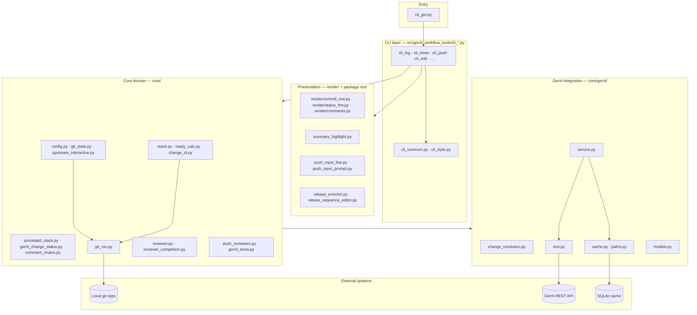
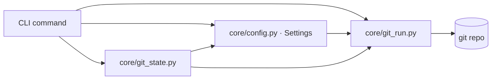
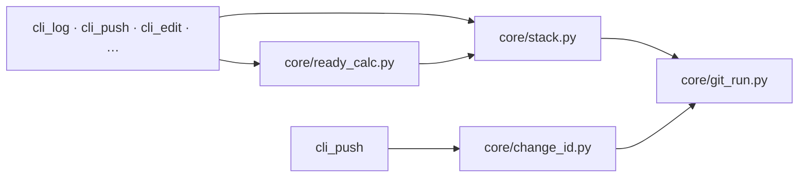
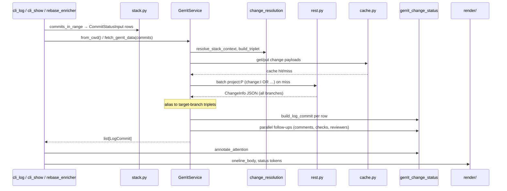
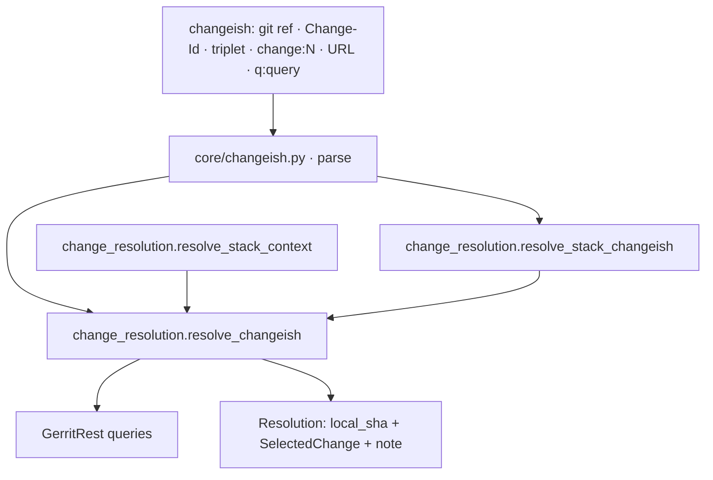
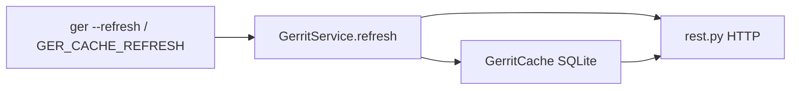

# Architecture overview

How **`ger`** is structured, which module owns each concept, and how data flows between layers. Command behavior: [spec/commands/](spec/commands/). Vocabulary: [CONTEXT.md](../CONTEXT.md).

---

## Repository layout

| Path | Role |
|------|------|
| `src/gerrit_workflow_tools/` | All application code (Python package) |
| `src/gerrit_workflow_tools/cli_*.py` | One module per shipped command (+ dispatcher) |
| `src/gerrit_workflow_tools/core/` | Domain logic: git stack, config, Gerrit status, REST |
| `src/gerrit_workflow_tools/core/gerrit/` | Gerrit REST client, SQLite cache, service orchestration, change resolution |
| `src/gerrit_workflow_tools/render/` | Terminal formatting for commit rows, status tokens and comments |
| `src/gerrit_workflow_tools/*.py` (package root) | Presentation helpers not tied to a single command |
| `contrib/completion/ger.bash` | Shipped bash completion script |
| `docu/` | User guides, specs, this document |
| `tests/` | Unit tests (default `pytest` run) |
| `tests/integration/` | Docker + real Gerrit tests (opt-in) |
| `scripts/` | Dev helpers (e.g. remote test sync) |

Entry point: `pyproject.toml` registers `ger = gerrit_workflow_tools.cli_ger:main`.

---

## Layer model

```mermaid
flowchart TB
  subgraph entry [Entry]
    ger[cli_ger.py]
  end

  subgraph cli [CLI layer — src/gerrit_workflow_tools/cli_*.py]
    common[cli_common.py · cli_style.py]
    commands[cli_log · cli_show · cli_push · cli_edit · …]
  end

  subgraph presentation [Presentation — render/ + package root]
    render[render/commit_row.py · render/status_fmt.py · render/comments.py]
    highlight[summary_highlight.py]
    push_ui[push_input_line.py · push_input_prompt.py]
    rebase_hook[rebase_enricher.py · rebase_sequence_editor.py]
  end

  subgraph core [Core domain — core/]
    stack[stack.py · ready_calc.py · change_id.py]
    status[annotated_stack.py · gerrit_change_status.py · comment_chains.py]
    config[config.py · git_state.py · upstream_interactive.py]
    git[git_run.py]
    reviewers[reviewer.py · reviewer_completion.py]
    push_core[push_reviewers.py · gerrit_show.py]
  end

  subgraph gerrit [Gerrit integration — core/gerrit/]
    resolution[change_resolution.py]
    service[service.py]
    rest[rest.py]
    cache[cache.py · paths.py]
    models[models.py]
  end

  subgraph external [External systems]
    git_repo[(Local git repo)]
    gerrit_api[(Gerrit REST API)]
    sqlite[(SQLite cache)]
  end

  ger --> commands
  commands --> common
  commands --> core
  commands --> presentation
  core --> gerrit
  service --> rest
  service --> cache
  rest --> gerrit_api
  cache --> sqlite
  stack --> git
  config --> git
  git --> git_repo
```

| Layer | Location | Responsibility |
|-------|----------|----------------|
| **Entry** | `cli_ger.py` | Lazy command dispatch, global `--refresh` → `GER_CACHE_REFRESH` |
| **CLI** | `cli_*.py`, `cli_common.py`, `cli_style.py` | Argparse, exit codes, stderr/stdout UX, logging/color init |
| **Presentation** | `render/`, `summary_highlight.py`, push/rebase helpers | Column layout, ANSI tokens, interactive push prompt, `GIT_SEQUENCE_EDITOR` wrappers |
| **Core** | `core/` (except `core/gerrit/`) | Stack math, config, Change-Id rules, status model, git subprocess wrapper |
| **Gerrit integration** | `core/gerrit/` | REST HTTP, caching, batch fetch, changeish resolution, `GerritService` |
| **External** | git, Gerrit server, `~/.cache/ger/` SQLite | Persistent state and I/O |

### Rules

Enforced by [`tests/test_architecture.py`](../tests/test_architecture.py), which runs in the pre-commit hook:

- `core/` imports only `core/`, and never prints or prompts.
- The substrate (`core/git_run.py`, `core/config.py`, `core/call_trace.py`, `core/changeish.py`, `core/change_id.py`) imports nothing above itself.
- `render/` does not import `cli_*`.
- A command module is imported only by `cli_ger.py` and `bash_completion_generator.py`.
- No module imports another module's `_private` name.
- One owner per concept: git runs through `core/git_run.py`, commit rows are read by `core/stack.py`, and `HttpGerritRest` is built by `GerritService.from_cwd` plus the few owners the test names.
- Every command builds its runtime with `init_cli_runtime` and wraps its body in `run_cli_command`.
- Modules stay at or under 400 lines. Larger ones are pinned at their size and only shrink; so do counts of `# pylint: disable=too-many-*`.

Each rule's known exceptions are listed in the test and tied to an item in the [consolidation backlog](#consolidation-backlog).

---

## Information flows

### 1. Command dispatch

```mermaid
sequenceDiagram
  participant User
  participant ger as cli_ger
  participant cmd as cli_&lt;command&gt;
  participant common as cli_common

  User->>ger: ger [--refresh] &lt;command&gt; [args]
  opt --refresh
    ger->>ger: GER_CACHE_REFRESH=1
  end
  ger->>cmd: lazy import + main(args)
  cmd->>common: init_cli_runtime (logging, color, Settings)
  cmd->>common: run_cli_command (errors → exit codes)
```

Every command module owns its argparse schema, builds its runtime with `init_cli_runtime`, and wraps its body in `run_cli_command` — the only place errors map to exit codes ([spec/exit-codes.md](spec/exit-codes.md)).

---

### 2. Configuration and git substrate

Most commands eventually read git config or invoke git:

```mermaid
flowchart LR
  cmd[CLI command]
  config[core/config.py · Settings]
  state[core/git_state.py]
  git[core/git_run.py]
  repo[(git repo)]

  cmd --> config
  cmd --> state
  cmd --> git
  state --> config
  config --> git
  state --> git
  git --> repo
```

`config.py` holds **settings only**. A command builds one immutable `Settings` at its entry point (`init_cli_runtime`, or `Settings.from_cwd(cwd)`) from a single `git config --list`, then passes it down; there is no process-wide cache and nothing to invalidate. Keys like `gerrit.webUrl`, `gerrit.remote`, `branch.*.gerritTarget`, and `gerrit.stopPattern` drive downstream behavior. See [Configuration.md](Configuration.md).

`git_state.py` answers what the repository currently looks like — branch, HEAD, rebase state, upstream, and the Gerrit push destination. It may read settings; `config.py` never queries repository state, so the dependency runs one way.

`upstream_interactive.py` prompts the user when a branch lacks `@{upstream}` — used by log, push, edit, rebase, change-id, sha.

---

### 3. Local stack inspection

The **local stack** is commits in `upstream_tip..HEAD` (or an explicit `REV_RANGE`).

```mermaid
flowchart LR
  cmd[cli_log · cli_push · cli_edit · …]
  stack[core/stack.py]
  ready[core/ready_calc.py]
  cid[core/change_id.py]
  git[core/git_run.py]

  cmd --> stack
  cmd --> ready
  stack --> git
  ready --> stack
  push[cli_push] --> cid
  cid --> git
```

| Step | Module | Output |
|------|--------|--------|
| Resolve upstream tip | `stack.upstream_tracking_tip_and_display` | `(sha, display_name)` |
| List commits | `stack.commits_in_range` | `list[Commit]` (sha, subject, body, footer value) |
| Ready boundary | `ready_calc.compute_ready` | push range before stop pattern / first Change-Id error |

---

### 4. Gerrit overlay (log, show, rebase enrichment)

Read-only commands overlay Gerrit state on local commits:

```mermaid
sequenceDiagram
  participant CLI as cli_log / cli_show / rebase_enricher
  participant Stack as stack.py
  participant Svc as GerritService
  participant Res as change_resolution
  participant REST as rest.py
  participant Cache as cache.py
  participant Status as gerrit_change_status
  participant Render as render/

  CLI->>Stack: commits_in_range → CommitStatusInput rows
  CLI->>Svc: from_cwd() / fetch_gerrit_data(commits)
  Svc->>Res: resolve_stack_context, build_triplet
  Svc->>Cache: get/put change payloads
  Cache-->>Svc: cache hit/miss
  Svc->>REST: batch project:P (change:I OR …) on miss
  REST-->>Svc: ChangeInfo JSON (all branches)
  Note over Svc: alias to target-branch triplets
  Svc->>Status: build_log_commit per row
  Svc->>Status: parallel follow-ups (comments, checks, reviewers)
  Svc-->>CLI: list[LogCommit]
  CLI->>Status: annotate_attention
  CLI->>Render: oneline_body, status tokens
```

**Shared pipeline:** `GerritService.fetch_gerrit_data` is the local-stack enrichment entry point used by `ger log`, `ger show`, and the rebase enricher. `GerritService.fetch_review_chains` is the query-driven sibling used by `ger inbox` — it must not resolve stack context.

**Annotated stack:** `core/annotated_stack.py` composes the local stack, the overlay and attention. `annotate(rows, service=…, cwd=…)` serves callers that already have rows (`ger log`, `ger show`, the rebase enricher); `load_annotated_stack(cwd, rev_range, …)` serves callers that start from a revision range (`ger log`, `ger edit --first-attention-commit`). It neither prints nor prompts.

**Fetch ≠ identity:** the overlay batch-loads with compact `project:P (change:I1 OR …)` queries (no `branch:` in the query). Client-side aliasing binds each requested target-branch triplet to the matching `ChangeInfo` row; other-branch duplicates stay cached under their own ids and are ignored for overlay status. Multi-branch **resolution notes** for `ger log` are derived from the local cache, with no per-Change-Id re-query.

**Status model:** `gerrit_change_status.py` defines `LogCommit`, the patchset states, and `determine_attention()`.

**Rendering:** `render/commit_row.py` (full rows for log/show) and `render/status_fmt.py` (compact tokens for rebase todo lines) both consume `LogCommit`.

---

### 5. Changeish resolution

Any input that might mean “a commit or Gerrit change” flows through one grammar and one resolver:

```mermaid
flowchart TB
  input[changeish: git ref · Change-Id · triplet · change:N · URL · q:query]
  classify[core/changeish.py · parse]
  stack_ctx[change_resolution.resolve_stack_context]
  resolve[change_resolution.resolve_changeish]
  stack_resolve[change_resolution.resolve_stack_changeish]
  rest[GerritRest queries]
  output[Resolution: local_sha + SelectedChange + note]

  input --> classify
  classify --> resolve
  classify --> stack_resolve
  stack_ctx --> resolve
  stack_resolve --> resolve
  resolve --> rest
  resolve --> output
```

| Consumer | Module | Use |
|----------|--------|-----|
| `ger resolve` | `cli_resolve.py` | Inspect resolution only (no side effects) |
| `ger show` | `core/gerrit_show.py` → `resolve_show_commit_row` | Pick one commit row, then enrich |
| `ger fix`, `ger edit`, `ger reword`, `ger rebase` | `resolve_stack_changeish` | Map a changeish to a commit in the local stack. `require_in_stack` is the one axis on which they differ ([ADR-0003](adr/0003-ger-fix-targets-the-local-stack.md)) |
| `ger log` | `core/annotated_stack.py` | Resolution notes per Change-Id |
| `ger push` | `cli_push.py`, `core/push_reviewers.py` | Triplet building for REST |

Stack context (`project`, `target_branch`, `push_branch`) comes from `git_state.py` + `gerrit_project_id.py`, over a `Settings`. Contract: [spec/change-and-commit-identifiers.md](spec/change-and-commit-identifiers.md).

---

### 6. Push pipeline

```mermaid
sequenceDiagram
  participant User
  participant Push as cli_push
  participant Ready as ready_calc
  participant Git as git push
  participant Rev as push_reviewers
  participant Svc as GerritService

  User->>Push: ger push [options]
  Push->>Ready: compute_ready (stop/strategy + Change-Id boundary)
  Push->>User: confirm / dry-run (push_input_prompt)
  Push->>Git: git push origin HEAD:refs/for/&lt;target&gt;[%opts]
  alt reviewer strategy lazy/overwrite
    Push->>Rev: apply reviewers per change
    Rev->>Svc: REST POST reviewers
  end
```

Push-specific UI lives in `push_input_line.py` (line editor state) and `push_input_prompt.py` (prompt-toolkit). Reviewer catalog/completion: `reviewer_catalog.py`, `core/reviewer_completion.py`.

---

### 7. Git mutation commands

| Command | Flow |
|---------|------|
| **`ger edit` / `ger reword`** | Resolve REV via `resolve_stack_changeish` → set `GIT_SEQUENCE_EDITOR=rebase_sequence_editor` → `git rebase -i` |
| **`ger rebase`** | Compute onto ref via `stack.merge_base_with_target` → set `GIT_SEQUENCE_EDITOR=rebase_enricher` → `git rebase -i` (enricher fetches Gerrit data, then opens real editor) |
| **`ger fix`** | `resolve_stack_changeish` → `git commit --fixup` |
| **`ger change-id --fix`** | `commit-tree` message rewrite using `change_id` helpers |
| **`ger push`** | See push pipeline above |

`ger edit --first-attention-commit` uses `load_annotated_stack`, so it applies the same attention rules as `ger log`.

---

### 8. Cache and refresh

```mermaid
flowchart LR
  refresh[ger --refresh / GER_CACHE_REFRESH]
  svc[GerritService.refresh]
  cache[GerritCache SQLite]
  rest[rest.py HTTP]

  refresh --> svc
  svc --> cache
  svc --> rest
  cache --> rest
```

`ger cache` (`cli_cache.py`) inspects or clears the SQLite DB. Paths: `core/gerrit/paths.py`. Cache-only / offline operation is a **trust window** policy on `GerritService`, not another `GerritRest` ([ADR-0001](adr/0001-offline-is-a-trust-window-not-a-gerritrest.md)).

---

### 9. The Gerrit seam

**`GerritRest`** (`core/gerrit/rest.py`) is the seam: single-round-trip Gerrit operations. Chunking, `OR` batching, triplet aliasing, the SQLite cache and parallelism all sit *above* it. It carries no `cwd`, and it has no raw-path escape hatch ([ADR-0002](adr/0002-no-raw-path-escape-hatch-on-gerritrest.md)).

| Implementation | Use |
|----------------|-----|
| `HttpGerritRest` | Talks to a real Gerrit over HTTP; credentials resolved at construction |
| `ChangeStore` (`tests/change_store.py`) | Answers from ChangeInfo payloads, with stateful writes. Test-only — nothing in `src/` constructs one |

Commands take a `gerrit` keyword argument and pass it to `GerritService.from_cwd(cwd, rest=…)`, the single construction path. Deliberate exceptions: `cli_fetch_api.py` (GETs a raw path from the real server by purpose), `reviewer_catalog.py` (background worker in the push prompt, [ADR-0006](adr/0006-push-prompt-gerrit-io-is-background.md)), and `resolve_stack_changeish` (builds a client lazily so a purely local resolution never needs `gerrit.webUrl`).

---

## Module catalog

One row per module, by package-relative path. **Owns** is the concept the module is the single home for: extend it rather than writing a second copy. [`tests/test_docs.py`](../tests/test_docs.py) fails when a module is missing here or a listed one no longer exists.

### Commands and CLI runtime

| Module | Owns |
|--------|------|
| `cli_ger.py` | Dispatcher: the command registry `_COMMANDS`, aliases, global `--refresh` |
| `cli_common.py` | Shared runtime: `ExitCode`, `init_cli_runtime`, `run_cli_command`, shared argparse groups |
| `cli_style.py` | ANSI color and hyperlink helpers |
| `cli_log.py` | `ger log` |
| `cli_inbox.py` | `ger inbox` |
| `cli_show.py` | `ger show` |
| `cli_push.py` | `ger push` |
| `cli_edit.py` | `ger edit`, `ger reword` |
| `cli_rebase.py` | `ger rebase` |
| `cli_fix.py` | `ger fix` |
| `cli_resolve.py` | `ger resolve` |
| `cli_sha.py` | `ger sha` |
| `cli_changeid.py` | `ger change-id` |
| `cli_setup.py` | `ger setup` |
| `cli_cache.py` | `ger cache` |
| `cli_fetch_api.py` | `ger fetch-api` (debug) |
| `cli_bash_completion.py` | `ger bash-completion` |

### Core domain (`core/`)

| Module | Owns |
|--------|------|
| `core/git_run.py` | Running git: the subprocess wrapper (`git`, `git_out`, `GitError`) |
| `core/config.py` | `Settings`: one `git config --list` snapshot of all `gerrit.*` and `branch.*` values |
| `core/git_state.py` | Repository state: branch, HEAD, rebase, upstream, Gerrit push destination |
| `core/call_trace.py` | git/Gerrit call timing for `--debug-log` |
| `core/changeish.py` | The changeish grammar: what an input naming a commit or change looks like |
| `core/change_id.py` | Change-Id footer: `parse_change_id_footer` (raw footer value), `validate_change_id_value`, `extract_valid_change_id`, `classify_issues`, generate and fix |
| `core/stack.py` | Local stack: reading commit rows from `git log`, ranges, merge-base |
| `core/ready_calc.py` | Ready boundary and push range |
| `core/ready_strategy.py` | Loading ready-boundary strategies from `.ger/ready/` |
| `core/annotated_stack.py` | Annotated stack: local stack + Gerrit overlay + attention |
| `core/gerrit_change_status.py` | `LogCommit`, patchset status, `determine_attention()`, merged equivalence |
| `core/attention_strategy.py` | Loading attention strategies from `.ger/attention/` |
| `core/review_chain.py` | Review chains from ChangeInfo payloads; unreviewed age, wait age |
| `core/comment_chains.py` | Inline comment threads, resolved and unresolved |
| `core/gerrit_message_parsing.py` | Parsing Gerrit change messages, including CI URLs |
| `core/ci_links.py` | CI failure names and transformed build links |
| `core/ci_strategy.py` | Loading CI link strategies from `.ger/ci/` |
| `core/ger_registry.py` | The shared two-tier loader for `.ger/<domain>/` extension registries |
| `core/gerrit_show.py` | `ger show` row resolution, including remote-only changes |
| `core/gerrit_project_id.py` | Gerrit project from config or remote URL |
| `core/push_reviewers.py` | Post-push reviewer strategies |
| `core/reviewer.py` | Reviewer account normalization from REST payloads |
| `core/reviewer_completion.py` | Account search for completion UIs |
| `core/reviewers_strategy.py` | Loading default-reviewer strategies from `.ger/reviewers/` |
| `core/upstream_interactive.py` | Prompting for a missing upstream (core that prompts — see backlog) |

### Gerrit integration (`core/gerrit/`)

| Module | Owns |
|--------|------|
| `core/gerrit/rest.py` | The `GerritRest` seam and `HttpGerritRest` |
| `core/gerrit/service.py` | `GerritService`: cache-aware batching, trust window, `fetch_gerrit_data`, `fetch_review_chains` |
| `core/gerrit/cache.py` | `GerritCache`: SQLite persistence keyed by triplet |
| `core/gerrit/change_resolution.py` | Changeish resolution, stack context, triplets, resolution notes |
| `core/gerrit/models.py` | Thin wrappers over REST payloads |
| `core/gerrit/paths.py` | Cache DB path and host key |

### Presentation (`render/` and package root)

| Module | Owns |
|--------|------|
| `render/commit_row.py` | Full commit line layout for log/show |
| `render/status_fmt.py` | Plain status tokens (patchset, CR, verified, comments) for editable contexts |
| `render/comments.py` | Inline comment chains, human and Markdown |
| `summary_highlight.py` | Subject highlighting from stop/warning patterns |
| `push_input_line.py` | Push options line: parsing and formatting |
| `push_input_prompt.py` | Interactive push UI (prompt-toolkit) |
| `reviewer_catalog.py` | Reviewer discovery and soft validation for the push prompt |
| `rebase_enricher.py` | `GIT_SEQUENCE_EDITOR`: annotate the rebase todo with Gerrit status |
| `rebase_sequence_editor.py` | `GIT_SEQUENCE_EDITOR`: patch one `pick` line for `ger edit` |
| `bash_completion_generator.py` | Bash completion generated from live argparse definitions |

---

## Consolidation backlog

Concepts that still exist more than once, ranked by how far the copies have **drifted** — divergence is the cost, not line count. Each item names the exceptions that track it in [`tests/test_architecture.py`](../tests/test_architecture.py); fixing the item means deleting them. Resolve each drift to *one* stated behaviour, and record a choice that would otherwise be re-suggested as an ADR.

1. **One commit reader.** `core/stack.py` reads commit rows (`_LOG_SHA_BODY_FMT`, `parse_git_log_sha_body_rs`, the inline format in `commits_in_range`). `cli_sha.py` re-types that format and imports the private `_parse_rs_metadata_records`; `cli_changeid.py` has its own 11-field format and split; `rebase_enricher.py` has its own `_RS` and a third walk. They disagree on the **footer value**: `stack` keeps it raw, `rebase_enricher` validates. *Tracked by:* the `%x1e` concept, the private-import rule.
2. **One command entry point.** Seven commands skip `init_cli_runtime` and seven skip `run_cli_command`, so they differ in logging, color, `Settings` construction and exit-code mapping. *Tracked by:* `test_commands_use_shared_runtime`.
3. **One resolution-note sink.** `_print_resolution_note` is copied in `cli_show.py` and `cli_resolve.py` (dimmed); `cli_edit.py`, `cli_fix.py` and `cli_rebase.py` each print `format_resolution_note` themselves (plain).
4. **One REST call envelope.** Each `HttpGerritRest` method repeats encode-path → `_request_json` → type check → log; `ChangeApi` repeats invalidate-then-refresh.
5. **One reviewer normalizer.** `cli_push._reviewer_accounts_from_change_info` duplicates `reviewer_accounts_from_change_info` in `core/reviewer.py`. Reviewer logic is spread over `core/reviewer.py`, `core/reviewer_completion.py`, `core/push_reviewers.py`, `core/reviewers_strategy.py` and `reviewer_catalog.py`.
6. **One Change-Id audit.** `change_id.classify_issues` and `cli_changeid.py`'s own loop classify the same footer problems independently.
7. **One confirmation prompt.** y/n parsing lives in `cli_push.py` (`_prompt_save_reviewers`, `_parse_confirm_answer`, `_parse_gerrit_push_confirm`) and `cli_fix.py`. *Tracked by:* the y/n concept.
8. **One git runner.** `core/git_run.py` cannot run interactively, feed stdin or return bytes, so `cli_edit.py`, `cli_rebase.py`, `cli_push.py` and `core/gerrit_change_status.py` call `subprocess` directly. *Tracked by:* the subprocess concept.
9. **Styling below the CLI.** `render/commit_row.py`, `render/comments.py`, `summary_highlight.py` and `push_input_prompt.py` import `cli_style.py`. Moving the ANSI helpers into `render/` makes presentation depend only downward. *Tracked by:* `test_render_does_not_import_cli`.
10. **Core that talks to the terminal.** `core/upstream_interactive.py` prompts for an upstream; `core/call_trace.py` prints its summary. The prompt belongs in the CLI; the summary can be returned as data. *Tracked by:* `test_core_has_no_terminal_io`.
11. **Cache-clear hub.** `git_run.clear_git_cache` imports upward into `core/git_state.py` and `core/gerrit/change_resolution.py` to clear caches it does not own. *Tracked by:* `test_substrate_stays_at_the_bottom`.
12. **Show resolution vs generic resolution.** `core/gerrit_show.py` wraps `resolve_changeish` but calls `GerritRest.get_change` itself to build a row for remote-only changes, next to what `ger resolve` already exposes.

---

## Onboarding

Full checklist: **[Getting-Started.md](Getting-Started.md)**.

Daily flow: `ger log` → `ger show <ref>` → `ger push`. Interpret log output: [Reading-ger-log.md](Reading-ger-log.md).

---

## Spec maintenance

When changing behavior:

1. Update the relevant `spec/commands/<cmd>.md`.
2. Run unit tests; integration tests under `tests/integration/` (optional, Docker).
