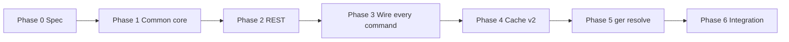

# Plan: Gerrit-native change resolution

**Status:** **Implemented** — Phases 0–6 complete (shared resolution core, triplet-aware REST/cache, commands wired, `ger resolve`, integration tests, operator docs).

Historical implementation plan for moving from **bare Change-Id** (treated as unique) to **Gerrit's real identity model**: `project~branch~changeId`, numeric change id, or explicit REST triplet paths — resolved through **one shared core**, used by every command.

The user-facing behavior contract lives in
[spec/change-and-commit-identifiers.md](../spec/change-and-commit-identifiers.md)
(changeish grammar, duplicate-Change-Id handling, JSON `resolution` output, exit codes).

---

## Principles

1. **Change-Id alone is never a Gerrit unique key** — multiple `ChangeInfo` rows are valid.
2. **Triplet is the default for stack commands** — built from `gerrit.project` + Gerrit destination branch + footer Change-Id (same branch Gerrit uses for `refs/for/<branch>`).
3. **One resolver, every command.** A single core owns classification, stack context, and ambiguity narrowing ([behavior spec §2–§3](../spec/change-and-commit-identifiers.md#2-resolution-algorithm)). `ger log`, `ger show`, `ger push`, `ger fix`, `ger edit`, `ger rebase`, and reviewer plumbing call it; [`ger assign`](../spec/commands/assign.md) will when it ships.
4. **Never collapse silently** — no `rows[0]` / last-wins dict. Ambiguity handling (target-branch narrowing + transparency) is defined in [the behavior spec, §3](../spec/change-and-commit-identifiers.md#3-duplicate-change-ids-the-important-case), and lives in the shared core, not in individual commands.
5. **Change-Ids are case-sensitive strings.** No normalization (no lowercasing, no `norm_change_id`). A Change-Id is whatever string appears in the footer or `ChangeInfo.change_id`; it is compared and keyed on literally.
6. **Alpha-stage tool: breaking changes ship directly.** No deprecation windows, no dual-read/dual-write migrations. Document the change in the changelog and move on.
7. **Each phase ships green** — small PRs, tests per step.

---

## Previous state (before Phases 0–6)

These problems existed before the shared resolver shipped; all rows below are **fixed** except `ger assign` (still planned).

| Layer | Was broken | Fixed in |
|-------|------------|----------|
| `batch_load_change_details` | Queried `change:I…` only; `_ingest_change_rows` keyed by `norm_change_id(change_id)` → last wins | Phase 2 |
| `query_single_change` | Returned `rows[0]` | Phase 2 |
| `probe_changes_updated` | Bare Change-Id keying | Phase 2 |
| `GerritCache` | `changes.change_id` PK = bare Change-Id | Phase 4 (schema v2, triplet PK) |
| `fetch_gerrit_data` | Lookup via `norm_change_id` | Phase 3 |
| `resolve_gerrit_change` / `pick_change_from_query_result` | Hard-errors on any ambiguity — no target-branch narrowing | Phase 1 |
| `resolve_change_ref` | Bare digits → `change:<n>`, colliding with short SHAs | Phase 1 |
| Per-command resolution copies | `cli_push.py`, `reviewer_catalog.py`, `cli_fix.py`, `fetch_gerrit_data` callers each had own logic | Phase 3 |
| `branch.*.gerritTarget` | Documented but not read in code | Phase 1 (`resolve_stack_context`) |

**Already in place before this work:**

- `resolve_gerrit_project_name()` (`core/gerrit_project_id.py`)
- `change_id_for_gerrit_rest_path()` accepts triplets (`core/gerrit/rest.py`)
- `gerrit.project` config key

---

## Target model

```
ChangeRef = numeric id | triplet (project~branch~changeId) | bare Change-Id (input only)

Stack context (cwd + working branch):
  project  ← gerrit.project || parse(gerrit.remote URL)
  branch   ← branch.<name>.gerritTarget || upstream on gerrit.remote
  triplet  ← f"{project}~{push_branch}~{changeId}"   (changeId used verbatim, no case folding)

Gerrit access:
  REST:  GET changes/{triplet-or-number}/...
  Query: project:{p} branch:{b} change:{I...}   (batch OR chunks)
```

`ChangeInfo.id` from Gerrit is the canonical triplet — use it for cache keys and follow-up REST calls (comments, checks, reviewers).

Local footer `Change-Id` vs. Gerrit change identity are kept distinct on purpose;
see [behavior spec §3.2 and §4](../spec/change-and-commit-identifiers.md#32-principles).

**One resolver.** All of the above — classification, stack context, triplet
building, and ambiguity narrowing — lives in `core/gerrit/change_resolution.py`
(`resolve_changeish`, `resolve_stack_context`). See [Phase 1](#phase-1--common-resolution-core).

---

## Phases

### Phase 0 — Spec & vocabulary (no behavior change)

**Goal:** Single documented contract before code moves.

The contract is written:
[spec/change-and-commit-identifiers.md](../spec/change-and-commit-identifiers.md).
Phase 0 wired the surrounding docs to it (see **Status** below).

**Deliverables:**

- New section in [architecture.md](../architecture.md): **Change identity**, linking to the behavior spec and naming the shared resolution core as the single source of truth.
- Update [spec/commands/log.md](../spec/commands/log.md), [show.md](../spec/commands/show.md), [push.md](../spec/commands/push.md), [fix.md](../spec/commands/fix.md), [edit.md](../spec/commands/edit.md) — note that every command resolves via the shared core, cross-linking the spec.

**Done when:** Surrounding docs point at the contract; no code changes required yet.

**Status:** Complete — [architecture.md](../architecture.md) has a **Change identity** section; [log](../spec/commands/log.md), [show](../spec/commands/show.md), [push](../spec/commands/push.md), [fix](../spec/commands/fix.md), and [edit](../spec/commands/edit.md) command specs cross-link the behavior contract and name the shared core.

---

### Phase 1 — Common resolution core

**Goal:** One module, one function, that every command calls for *all* changeish resolution — classification, stack context, triplet building, **and** ambiguity narrowing.

**Shipped as:** `resolve_changeish()` and `resolve_stack_context()` in
`core/gerrit/change_resolution.py` (stateless functions taking an explicit
`GerritClient`). Public contract: given a changeish string and stack context,
return a `Resolution` (`kind`, `selected`, `selected_reason`, `ambiguous`,
`alternatives`, `local_sha`) — mirrors the [`resolution` JSON block](../spec/change-and-commit-identifiers.md#5-machine-readable-resolution-for-automation).

**Responsibilities (all in this one module):**

| Responsibility | Spec section |
|---|---|
| Classify a changeish string (`git-rev`, `change-id`, `triplet`, `change-number`, `change-ref`, `url`, `query`) | [§2.1](../spec/change-and-commit-identifiers.md#21-classify) |
| Bare integer → git revision by default; `change:<n>` required for a change number | [§2.2](../spec/change-and-commit-identifiers.md#22-disambiguation-rules) — reverses today's `resolve_change_ref`; **ship directly, no deprecation** (Principle 6) |
| Resolve stack context: `project`, target branch (`branch.<name>.gerritTarget` → upstream), push branch | [§2.3](../spec/change-and-commit-identifiers.md#23-the-stack-context) |
| Build triplets from stack context + footer Change-Id (verbatim, case-sensitive) | [Target model](#target-model) |
| Ambiguity narrowing for a bare Change-Id: filter to target branch → prefer open over abandoned/merged → still >1 means a real ambiguity error | [§3.1](../spec/change-and-commit-identifiers.md#31-expected-behavior) |
| Produce the `Resolution` result (`selected`, `selected_reason`, `ambiguous`, `alternatives`) | [§5](../spec/change-and-commit-identifiers.md#5-machine-readable-resolution-for-automation) |

**Config fix:** Read `branch.<name>.gerritTarget` as part of stack-context resolution (documented but missing today).

**Tests (this phase carries the hard cases — it's the one place they can go wrong):**

- Classification: every kind in the table above, plus the reversed bare-integer case.
- Triplet build/parse round-trip; project from remote URL + override; destination branch: upstream vs `gerritTarget` override.
- Error when project or destination branch cannot be resolved.
- **Narrowing:** same Change-Id on two branches → target-branch match selected, `selected_reason="target-branch"`, other branch in `alternatives`.
- **Narrowing:** same Change-Id, one abandoned + one open, both on target branch → open one selected, `selected_reason="prefer-open"`.
- **Still ambiguous:** two open changes on target branch with same Change-Id → ambiguity error, both listed as candidates (number + triplet).
- **Absent case:** Change-Id only exists on a different branch → `absent` for read-only overlay commands, per [§3.1 item 4](../spec/change-and-commit-identifiers.md#31-expected-behavior).

**Done when:** The core module exists, is fully tested against every scenario in spec §2–§5, and **no caller has been switched yet**. `pick_change_from_query_result`'s current hard-error stays as the low-level REST primitive the core calls internally when it decides "still ambiguous" — Phase 2 does not change its signature, only who calls it and when.

**Status:** Complete — `core/gerrit/change_resolution.py`, tests in `tests/test_change_resolution.py` (and related).

---

### Phase 2 — REST/query layer: triplet-aware, policy-free fetch

**Goal:** Fix the lowest layer so it's a pure data-fetching primitive. All ambiguity *policy* now lives in Phase 1's core — this phase only makes sure the right data is fetchable and nothing silently collapses.

**Changes in `core/gerrit/rest.py`:**

1. **`batch_load_change_details(client, refs: list[str])`**
   - Input: triplets (or numeric ids), not bare Change-Ids.
   - Query: `project:{p} branch:{b} change:{I…}` per ref, OR-chunked.
   - Alternative for singles: `GET changes/{triplet}` (simpler, unambiguous).
   - **`_ingest_change_rows`**: key by `row["id"]` (triplet), **verbatim** — no `norm_change_id`, no case folding anywhere in this path.

2. **`query_single_change`**: require triplet/number; remove `rows[0]` on multi-match.

3. **`probe_changes_updated`**: probe by triplet keys; ingest keyed by `id`, verbatim.

4. **`resolve_change_ref(arg)`**: recognize triplets (`~` in arg); drop the bare-digit → `change:<n>` fast path (moved to Phase 1's classifier — bare digits are no longer this function's concern).

**Tests:**

- Mock: two changes, same Change-Id, different branches → batch returns **two** entries, no overwrite.
- Triplet query returns exactly one.
- Query with 2 results for a single triplet/number key → treated as a data error (should be impossible; assert it's surfaced, not silently picked).
- Case-sensitivity regression test: a Change-Id and its differently-cased twin are treated as **different** keys (documents the "no normalization" decision so it can't regress silently).

**Done when:** REST layer is correct and policy-free in isolation; tests prove the new API; nothing here decides *which* of several matches to use — that's Phase 1's job.

**Status:** Complete — `batch_load_change_details`, `query_single_change`, `probe_changes_updated`, and `resolve_change_ref` are triplet/numeric aware; `_ingest_change_rows` keys by `row["id"]` verbatim; tests in `tests/test_gerrit_rest.py`.

---

### Phase 3 — Wire every command through the core

**Goal:** All commands resolve changeishes through Phase 1's core — no exceptions, no "we'll get push later." This replaces what would otherwise be two disconnected efforts (fixing the `fetch_gerrit_data` callers vs. fixing `cli_push.py`/`cli_fix.py`/reviewers separately); doing it as one phase is exactly what "one resolver, every command" (Principle 3) requires, and avoids a state where some commands look fixed while others silently still use the old per-command logic.

**Call sites switched to the core (`resolve_changeish` / equivalent from Phase 1):**

| Area | Today | After |
|------|-------|-------|
| `cli_log.py`, `cli_show.py`, `rebase_enricher.py` | `fetch_gerrit_data` → `norm_change_id` lookup | `fetch_gerrit_data` resolves stack context once via the core, builds triplets, looks up by `id` |
| `cli_push.py` preview (`_commit_lines_for_preview`) | `service.changes.get_payloads(ids)` on bare Change-Ids | Triplet-keyed detail map via the core |
| `cli_push.py` / `push_reviewers.py` post-push reviewer apply | `stack_change_ids_ordered` (bare Change-Ids) | `stack_change_refs_ordered` (triplets), built via the core |
| `cli_fix.py` / `gerrit_show.py` | `REF_OR_CHANGE` via old `resolve_change_ref` digit rule | Full changeish via the core; bare integer now means git revision |
| `reviewer_catalog.py` | Own `resolve_gerrit_project_name(cwd)` call | Same project resolution, but sourced from the core's stack context so there's one code path for "what project are we in" |
| `GerritClient` follow-up calls (comments, checks, reviewers) | Keyed off footer Change-Id | Keyed off the **resolved** triplet from the core's `Resolution.selected` |

**New surface unlocked by having the core (this is where the previously-missing spec deliverables land):**

- `resolution` JSON block on every resolving command's `--json` output ([spec §5](../spec/change-and-commit-identifiers.md#5-machine-readable-resolution-for-automation)) — trivial now, since the core already returns a `Resolution` object; each command just serializes it.
- Ambiguity exit code `4` ([spec §6](../spec/change-and-commit-identifiers.md#6-exit-codes-resolution-related)): commands map `Resolution.ambiguous and no confident pick` to exit `4` instead of today's overloaded codes (`ger sha`'s local-history duplicate code is unrelated and stays as-is — see [spec §4](../spec/change-and-commit-identifiers.md#4-per-command-expectations), `ger sha` row).

**Error UX:** If stack context is missing (no project / no destination branch), same class of error as today's `ger push` ("set upstream" / configure `gerrit.project`) — the core raises this once, consistently, for every caller.

**Tests:**

- `test_log.py`, `test_show.py`, `test_rebase_enricher.py`, `test_push.py`, `test_fix.py`, `test_push_reviewers.py`, `test_reviewer_catalog.py`: mocks switched from Change-Id-keyed to triplet-keyed.
- New test: same Change-Id on `main` vs `dev` — log on `main` stack shows `main` change only (`absent` for the other); `ger show` on the same Change-Id shows the narrowed pick with a note.
- New test: `resolution` JSON block present and correct shape on `ger log --json` / `ger show --json` / `ger push --json` (if it has one) / `ger fix --json`.
- New test: ambiguity that survives narrowing exits `4`, not the old overloaded code, on at least one command per family (read-only + mutation).

**Done when:** Every command that resolves a changeish — `log`, `show`, `push`, `fix`, `edit`, `rebase`, `assign` (when it exists), reviewer plumbing — goes through the Phase 1 core. No command has its own copy of classification, narrowing, or triplet-building logic left.

*(This phase is large; split it into multiple PRs by command family — e.g. "read-only overlay: log/show/rebase" then "mutations: push/fix/reviewers" — but land them under one phase/tracking issue since they share the same core and the same tests-for-the-core dependency.)*

**Phase 3a status:** Complete — `fetch_gerrit_data` resolves stack context and triplet-keys detail lookup; `ger show` uses `resolve_changeish` with resolution JSON/notes and exit codes 3/4; `ger log` emits stack context in `--json` and resolution notes on stderr; tests updated for triplet-keyed mocks.

**Phase 3b status:** Complete — `cli_push`, `cli_fix`, `push_reviewers`, and `reviewer_catalog` wired through the shared core; bare integer → git revision; resolution JSON and exit code 4 on ambiguity.

---

### Phase 4 — Cache schema v2

**Goal:** Disk cache matches Gerrit identity.

**Changes in `core/gerrit/cache.py`:**

- `SCHEMA_VERSION = "2"`.
- PK = triplet (`id` field), verbatim string, no case folding — dedicated `change_key` column if the triplet doesn't work directly as a SQLite TEXT PK.
- `comments.change_id` → same triplet key.
- On schema bump: drop old tables (existing behavior) — document that `ger --refresh` / cache clear happens on upgrade.
- `upsert_changes`: always store under `payload["id"]`, verbatim.

**Update:** `probe_changes_updated` cache invalidation paths, `ger cache` info if it displays keys.

**Tests:** `test_gerrit_cache.py` — two triplets, same footer Change-Id (differing only by branch), both cached independently; a Change-Id and its differently-cased twin (if that can ever occur) are cached as distinct entries.

**Done when:** No cache collision across branches, and no normalization step exists anywhere in the cache read/write path.

**Status:** Complete — schema v2, triplet PK, tests in `tests/test_gerrit_cache.py`.

---

### Phase 5 — `ger resolve` command

**Goal:** Ship the side-effect-free resolver the spec proposes ([§4.1](../spec/change-and-commit-identifiers.md#41-proposed-helper-ger-resolve)). This is now a thin CLI wrapper — all the logic already exists in Phase 1's core and is already exercised by every other command via Phase 3.

```
ger resolve <changeish> [--json]
```

- Text output: resolved local SHA (if any), selected Gerrit change (number + triplet + branch + status), ambiguity note.
- `--json`: prints the `resolution` block ([spec §5](../spec/change-and-commit-identifiers.md#5-machine-readable-resolution-for-automation)) and nothing else.
- Exit codes per [spec §6](../spec/change-and-commit-identifiers.md#6-exit-codes-resolution-related).

**Tests:** one test per changeish kind (`git-rev`, `change-id` unique, `change-id` ambiguous/narrowed, `triplet`, `change-number`, `url`, `query`), plus `--json` shape.

**Done when:** `ger resolve` exists, documented in `spec/commands/resolve.md`, and its output is produced by the exact same core function every other command uses — no bespoke logic in the CLI layer beyond argument parsing and printing.

**Status:** Complete — `cli_resolve.py`, `tests/test_resolve.py`, `docu/spec/commands/resolve.md`.

---

### Phase 6 — Integration tests & operator docs

**Goal:** Prove real Gerrit behavior end-to-end — this is the phase that turns "the core is unit-tested" into "the tool actually works," per the goal of proving all works as expected.

- Integration fixture: push same patch content to two branches (or seed two changes with same Change-Id) → `ger log` on each branch shows correct status; `ger show <Change-Id>` narrows to the target branch with a visible note; `ger resolve <Change-Id> --json` and `ger show <Change-Id> --json` agree on the same `resolution` block (cross-command consistency is the actual point of Principle 3 — this test is what proves it, not just code review).
- Integration fixture: `ger fix 12345` (bare integer) resolves as a git revision, not a Gerrit change number — proves the [§2.2](../spec/change-and-commit-identifiers.md#22-disambiguation-rules) reversal actually shipped.
- Integration fixture: `ger push` on a stack, then `ger log`/`ger resolve` immediately after, confirms the pushed triplet is what gets cached and reused (no re-resolution drift between mutation and read paths).
- [Configuration.md](../Configuration.md): document `gerrit.project`, `branch.*.gerritTarget` as inputs for triplet resolution.
- Root [README.md](../../README.md): one paragraph on Change-Id vs triplet, linking to the behavior spec.

**Done when:** CI covers the cross-branch Change-Id scenario, the bare-integer reversal, and cross-command resolution consistency — the three things most likely to regress silently if a future change bypasses the shared core.

**Status:** Complete

| Deliverable | Where |
|-------------|--------|
| Cross-branch Change-Id; resolve/show JSON agreement; per-branch log | `tests/integration/test_09_change_resolution.py` (Docker Gerrit: resolve/show + log narrowing notes); unit fallback `tests/test_change_resolution_consistency.py` (full log overlay via mocks) |
| Bare integer `ger fix N` → git revision, not change number | `tests/test_fix.py::test_ger_fix_bare_integer_is_git_revision_not_change_number` |
| Push → log/resolve triplet consistency | integration `test_push_then_resolve_triplet_consistency`; unit `test_push_stack_resolve_and_show_agree_on_triplet` |
| `gerrit.project`, `branch.*.gerritTarget` for triplet resolution | [Configuration.md](../Configuration.md#change-identity-triplet-resolution) |
| Change-Id vs triplet (README) | [README.md](../../README.md) |

---

## Suggested PR order



Phase 3 is the biggest; split it into multiple PRs by command family (see note at the end of that phase) but keep it one tracking unit, since every sub-PR depends on the same Phase 1 core and is validated by the same class of tests. Phases 4 and 5 can reorder relative to each other if convenient — neither depends on the other, both depend on Phase 3 having landed for at least the read-only commands.

---

## Explicit non-goals

- SHA-based disambiguation among Gerrit changes
- Storing change-number mappings in git notes (future enhancement only)
- Changing local Change-Id generation or duplicate checks
- Deprecation window / dual-behavior flag for the bare-integer reversal — alpha stage, ship the breaking change directly (Principle 6)

(Branch-aware and prefer-open narrowing of an ambiguous Change-Id **is** in scope —
see [behavior spec §3.1](../spec/change-and-commit-identifiers.md#31-expected-behavior).
Only SHA-based ranking stays out.)

---

## Risks & mitigations

| Risk | Mitigation |
|------|------------|
| `gerrit.project` not set, remote URL unparseable | Clear error at stack-context resolution; document `gerrit.project` |
| Change on branch A, user's target is branch B | Correct Gerrit behavior: shows **absent** on B until pushed to `refs/for/B` |
| Cache invalidation after upgrade | Schema version bump auto-clears (existing pattern) |
| Batch query size | Keep `_BATCH_OR_CHUNK`; query uses triplets so OR count unchanged |
| `gerritTarget` was doc-only | Phase 1 implements it — note in changelog |
| Bare-integer reversal changes `ger fix 12345` / `ger show 12345` behavior | Accepted as a breaking change (alpha stage, Principle 6) — no migration, just a changelog entry and the Phase 6 integration test that proves the new behavior |
| Consolidating all policy into one core means a bug there affects every command | Mitigated by Phase 1's exhaustive test matrix (every narrowing scenario) landing **before** any caller switches in Phase 3, plus Phase 6's cross-command consistency test |
| Phase 3 is large (many call sites) | Split into per-command-family PRs; each is independently reviewable against the same already-tested core |

---

## First PR checklist (Phase 0 + 1)

- [x] Architecture section: change identity, naming the shared core
- [x] Command specs (`log`, `show`, `push`, `fix`, `edit`): change resolution cross-links
- [x] Common resolution core module + tests (classification, stack context, narrowing, `Resolution` shape)
- [x] `effective_gerrit_destination_branch` (or its Phase 1 replacement) reads `branch.*.gerritTarget`
- [x] All callers switched through Phase 3

---

## See also

- [spec/change-and-commit-identifiers.md](../spec/change-and-commit-identifiers.md) — the behavior contract this plan implements
- [architecture.md](../architecture.md) — shared concepts (**Change identity** section)
- [Configuration.md](../Configuration.md) — `gerrit.project`, `branch.*.gerritTarget`
- [spec/commands/log.md](../spec/commands/log.md) — primary consumer of stack overlay
